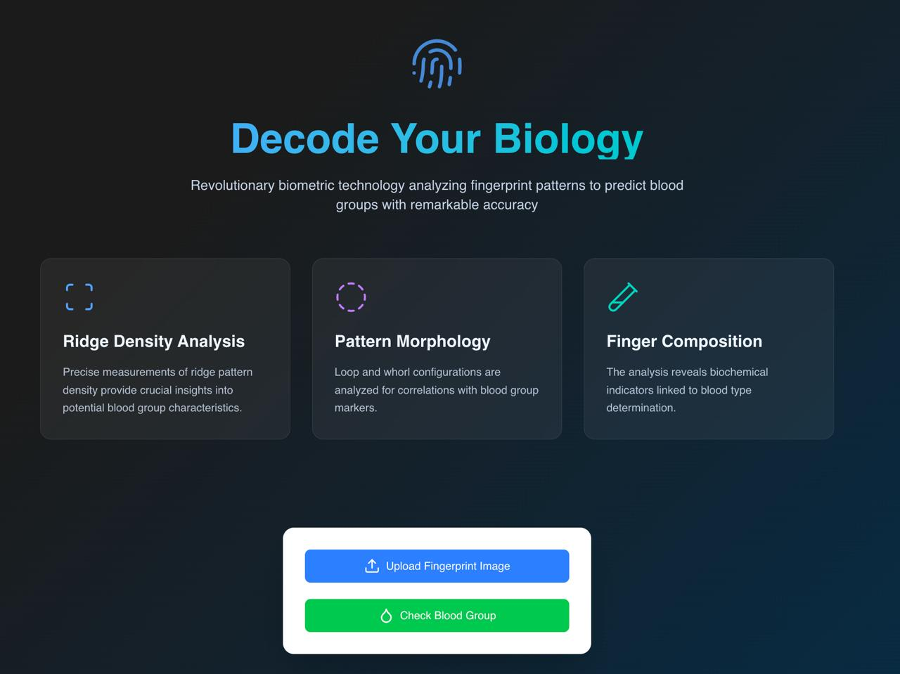
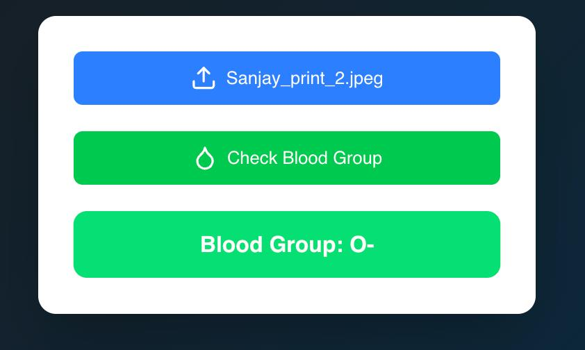

<div align="center">
  
  <h1>BloodSense: AI-Powered Fingerprint Blood Group Detection</h1>
  <p>
    <a href="#"></a>
    <a href="#"></a>
    <a href="#"></a>
    <a href="#"></a>
    <a href="#"></a>
  </p>
  <p><strong>Revolutionizing blood group detection through fingerprint analysis and deep learning</strong></p>
</div>

## 📑 Table of Contents

- [Overview](#overview)
- [Features](#features)
- [System Architecture](#system-architecture) 
- [Demo](#demo)
- [Installation](#installation)
- [How It Works](#how-it-works)
- [Model Performance](#model-performance)
- [Future Work](#future-work)
- [Addressing Challenges](#addressing-challenges)

## Overview

BloodSense is a cutting-edge deep learning system that analyzes fingerprint patterns to predict blood groups. This non-invasive approach offers a revolutionary alternative to traditional blood typing methods, potentially transforming emergency medical responses and healthcare in resource-limited settings.

The system combines:

- **Computer Vision** for fingerprint processing
- **Deep Learning** for feature extraction and classification
- **Modern Web Technologies** for an intuitive user interface

<div align="center">
  
  <p><em>BloodSense system dashboard interface</em></p>
</div>

## Features

| Feature | Description |
|---------|-------------|
| 🔍 **Multi-Blood Group Detection** | Supports all 8 major blood groups (A+, A-, B+, B-, AB+, AB-, O+, O-) |
| 🧠 **Advanced CNN Model** | 3-layer CNN with optimized architecture for fingerprint analysis |
| 📱 **Responsive Web Interface** | Modern UI built with Next.js for seamless user experience |
| ⚡ **Real-time Processing** | Fast image analysis and immediate results |
| 🐳 **Containerized Deployment** | Docker support for easy setup and scalability |
| 🔌 **RESTful API** | Well-documented endpoints for integration with other systems |

<div align="center">
  
  <p><em>Information about different blood groups detected by BloodSense</em></p>
</div>

## System Architecture

BloodSense follows a modern microservice architecture with three main components:

1. **Frontend**: Next.js application providing the user interface
2. **Backend API**: FastAPI service handling requests and model inference
3. **Deep Learning Model**: TensorFlow CNN model for blood group classification

<div align="center">
  
  <p><em>Detailed architecture showing data flow between components</em></p>
</div>

## Demo

<div align="center">
  
  <p><em>BloodSense prediction results showing detected blood group</em></p>
</div>

## Installation

### Option 1: Using Docker (Recommended)

The easiest way to get started is with Docker:

```bash
# Clone the repository
git clone https://github.com/siddharths060/BloodSense.git
cd BloodSense

# Start the application with Docker Compose
docker-compose up --build
```

This will start both the backend API service and the frontend web application.

### Option 2: Manual Setup

#### Backend Setup

```bash
# Clone the repository
git clone https://github.com/siddharths060/BloodSense.git
cd BloodSense

# Create and activate a virtual environment
python -m venv backendvenv
source backendvenv/bin/activate  # On Windows: backendvenv\Scripts\activate

# Install dependencies
pip install -r requirements.txt

# Run the backend server
cd backend
uvicorn main:app --reload
```

#### Frontend Setup

```bash
# Navigate to the frontend directory
cd frontend

# Install dependencies
npm install

# Run the development server
npm run dev
```

## How It Works

<div align="center">
  
  <p><em>End-to-end workflow from fingerprint upload to blood group prediction</em></p>
</div>

### Data Collection and Preprocessing

- **Dataset**: Our model is trained on a comprehensive dataset of fingerprint images, organized by blood groups
- **Preprocessing Pipeline**:
  - Images are resized to `128×128` pixels
  - Pixel values are normalized to the range `[0,1]`
  - Data augmentation techniques include random rotations, shifts, and flips

### Model Architecture

Our CNN model consists of:

```python
model = Sequential([
    Conv2D(32, (3,3), activation='relu', input_shape=(128, 128, 3)),
    MaxPooling2D(2,2),
    Conv2D(64, (3,3), activation='relu'),
    MaxPooling2D(2,2),
    Conv2D(128, (3,3), activation='relu'),
    MaxPooling2D(2,2),
    Flatten(),
    Dense(256, activation='relu'),
    Dropout(0.5),
    Dense(8, activation='softmax')  # 8 blood group classes
])
```

<div align="center">
  
  <p><em>BloodSense CNN architecture visualization</em></p>
</div>

### Prediction Process

1. User uploads a fingerprint image through the web interface
2. Image is preprocessed (resized, normalized)
3. Preprocessed image is fed to the trained model
4. Model predicts the most likely blood group
5. Result is displayed to the user with confidence score

## Model Performance

The current model achieves a validation accuracy of approximately 86% on the test dataset. Performance metrics include:

- **Accuracy**: 86%
- **Precision**: 85.2%
- **Recall**: 84.7%
- **F1 Score**: 84.9%

<div align="center">
  
  <p><em>Confusion matrix showing the model's performance across different blood groups</em></p>
</div>

## Future Work

We're constantly working to improve BloodSense. Planned enhancements include:

- **Model Accuracy**: Training on larger, more diverse datasets
- **Transfer Learning**: Leveraging pre-trained models for improved feature extraction
- **Confidence Thresholds**: Implementing minimum confidence requirements for predictions
- **Mobile Support**: Developing native mobile applications
- **Database Integration**: Adding secure storage for users and prediction history
- **Error Analysis**: Better handling of low-quality fingerprint images

<div align="center">
  
  <p><em>Roadmap for future development and improvements</em></p>
</div>

## Addressing Challenges

### Dealing with Misclassifications

Our current approach to improve classification accuracy:

| Challenge | Solution |
|-----------|----------|
| Poor image quality | Implement pre-processing filters to enhance image quality |
| Limited training data | Expand dataset with more diverse fingerprint samples |
| Feature overlap | Fine-tune model architecture to better distinguish subtle differences |
| Environmental factors | Add robustness through varied augmentation techniques |

### Technical Limitations

- **Hardware Requirements**: Optimizing for deployment on edge devices
- **Real-time Processing**: Balancing accuracy with speed for immediate results
- **Cross-Platform Compatibility**: Ensuring consistency across different systems

## Contributing

Contributions to BloodSense are welcome! Please follow these steps:

1. Fork the repository
2. Create a feature branch (`git checkout -b feature/amazing-feature`)
3. Commit your changes (`git commit -m 'Add some amazing feature'`)
4. Push to the branch (`git push origin feature/amazing-feature`)
5. Open a Pull Request

Please ensure your code adheres to our coding standards and includes appropriate tests.

## License

This project is licensed under the MIT License - see the [LICENSE](LICENSE) file for details.

## Contact

Siddharth S - [siddharths060@gmail.com](mailto:siddharths060@gmail.com)

Project Link: [https://github.com/siddharths060/BloodSense](https://github.com/siddharths060/BloodSense)
