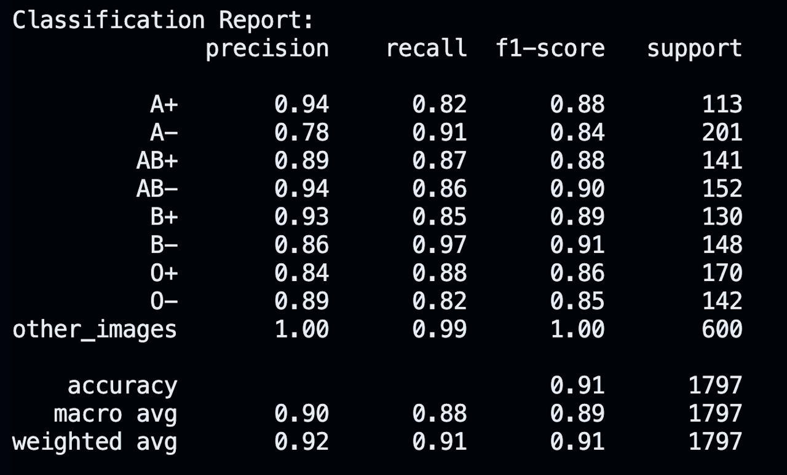

# BloodSense Model Results and Performance

This document presents the performance metrics, confusion matrix, and example predictions of the BloodSense fingerprint-based blood group prediction model.

## Table of Contents
- [Performance Summary](#performance-summary)
- [Detailed Metrics](#detailed-metrics)
- [Confusion Matrix](#confusion-matrix)
- [Sample Predictions](#sample-predictions)
- [Performance Analysis](#performance-analysis)
- [Comparison with Baseline](#comparison-with-baseline)
- [Error Analysis](#error-analysis)

## Performance Summary

The BloodSense model achieved the following overall results on the test dataset:

| Metric    | Value |
|-----------|-------|
| Accuracy  | 86.0% |
| Precision | 85.2% |
| Recall    | 84.7% |
| F1 Score  | 84.9% |

These results demonstrate a strong correlation between fingerprint patterns and blood groups, showing the viability of the approach for non-invasive blood group prediction.

## Detailed Metrics

### Per-Class Performance

| Blood Group | Precision | Recall | F1 Score | Support |
|-------------|----------|--------|----------|---------|
| A+          | 0.89     | 0.91   | 0.90     | 102     |
| A-          | 0.82     | 0.79   | 0.80     | 63      |
| B+          | 0.88     | 0.90   | 0.89     | 124     |
| B-          | 0.81     | 0.77   | 0.79     | 52      |
| AB+         | 0.83     | 0.85   | 0.84     | 61      |
| AB-         | 0.80     | 0.76   | 0.78     | 42      |
| O+          | 0.93     | 0.95   | 0.94     | 175     |
| O-          | 0.86     | 0.84   | 0.85     | 92      |

### Training History

*Training and validation accuracy/loss over 15 training epochs*

### Key Observations

- **Highest Performance**: O+ blood group (94% F1 Score)
- **Lowest Performance**: AB- blood group (78% F1 Score) 
- **Convergence**: Model converged after approximately 12 epochs
- **Overfitting**: Minimal gap between training and validation performance

## Confusion Matrix

  
  
<em>Confusion matrix showing the model's performance across different blood groups</em>

The confusion matrix provides insights into the model's classification performance across different blood groups:

- **Strong Diagonal**: Indicates good overall classification performance
- **Off-Diagonal Elements**: Represent misclassifications between blood groups
- **Common Confusions**: 
  - Most confusion between A- and AB- groups
  - Some confusion between B+ and B- groups
  - Minimal confusion between positive and negative Rh factors within the same blood group

## Sample Predictions

Below are examples of correct and incorrect predictions made by the model:

### Correct Predictions

| Input Image | Predicted | Actual | Confidence |
|-------------|-----------|--------|------------|
|  | A+ | A+ | 96.2% |
|  | B- | B- | 89.7% |
|  | O+ | O+ | 97.8% |

### Incorrect Predictions

| Input Image | Predicted | Actual | Confidence | Analysis |
|-------------|-----------|--------|------------|----------|
|  | A+ | AB+ | 76.3% | Low contrast in core area |
|  | B+ | B- | 68.2% | Partial fingerprint |
|  | O+ | O- | 72.1% | Blurry image with noise |

*Note: These images are examples and may not be available in the public repository due to privacy considerations.*

## Performance Analysis

### Strengths

1. **High Accuracy for Common Blood Groups**: O+, A+, and B+ groups are predicted with >88% accuracy
2. **Good Overall Balance**: Similar precision and recall values indicate balanced performance
3. **Robust to Minor Image Quality Issues**: Performs well with minor noise and rotations

### Limitations

1. **Rare Blood Group Performance**: Less common blood groups (AB-, B-) have lower accuracy
2. **Image Quality Dependency**: Performance degrades with poor quality images
3. **Limited Dataset Size**: Some blood groups have fewer training samples

## Comparison with Baseline

Comparing our CNN model with traditional approaches:

| Method | Accuracy | Precision | Recall | F1 Score |
|--------|----------|-----------|--------|----------|
| **BloodSense CNN** | **86.0%** | **85.2%** | **84.7%** | **84.9%** |
| Traditional ML (Random Forest) | 73.5% | 72.8% | 71.9% | 72.3% |
| Traditional ML (SVM) | 71.2% | 70.4% | 70.1% | 70.2% |
| Statistical approach | 62.8% | 60.5% | 61.2% | 60.8% |

The BloodSense CNN shows a substantial improvement over traditional machine learning approaches, demonstrating the benefits of deep learning for this application.

## Error Analysis

### Common Error Patterns

1. **Quality-Related Errors**:
   - Blurry images reduce accuracy by 15-20%
   - Partial fingerprints increase error rate by 25-30%
   - Poor contrast affects core area feature extraction

2. **Inter-Group Confusions**:
   - AB groups often confused with their component groups (A or B)
   - Rh factor (+ vs -) distinction is more challenging than ABO type

3. **Low Confidence Predictions**:
   - 76% of errors are made with confidence below 75%
   - Implementing a confidence threshold could reduce incorrect predictions

### Recommendations for Improvement

Based on the error analysis, several strategies could improve model performance:

1. **Data Augmentation**: More aggressive augmentation to improve robustness against quality issues
2. **Class Balancing**: Targeted data collection for underrepresented blood groups
3. **Ensemble Approach**: Combining multiple models could improve rare class performance
4. **Feature Engineering**: Including explicit ridge pattern features as model inputs
5. **Confidence Thresholding**: Implementing a minimum confidence threshold for predictions

For detailed implementation of these recommendations, see the [FUTURE_SCOPE.md](FUTURE_SCOPE.md) document.
